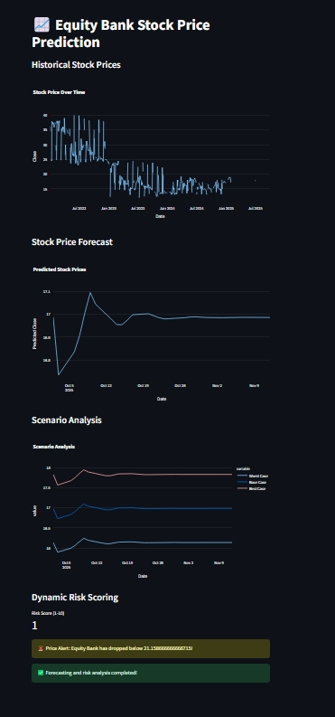
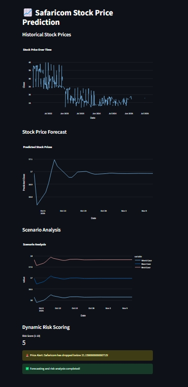

# **📈 Stock Price Prediction Dashboard**  

This project is a **real-time stock price forecasting and risk analysis dashboard** built using **Streamlit, Python, and Machine Learning**. It allows users to visualize **historical stock prices**, generate **future stock price predictions**, and perform **scenario analysis** for informed decision-making.  

## **🚀 Features**  
✅ **Historical Stock Prices** – Visualizes past stock price movements.  
✅ **Stock Price Forecasting** – Uses machine learning models (e.g., ARIMA, LSTM, Linear Regression) to predict future prices.  
✅ **Scenario Analysis** – Simulates different market conditions (Best Case, Worst Case, etc.).  
✅ **Dynamic Risk Scoring** – Assesses stock volatility and provides risk alerts.  
✅ **Interactive UI** – Users can select stocks, adjust forecasting days, and analyze results dynamically.  

## **🔧 Tech Stack**  
- **Python** (Pandas, Scikit-Learn, Statsmodels)  
- **Streamlit** (Frontend Dashboard)  
- **Yahoo Finance API** (Live Data Fetching)  
- **Machine Learning** (Time Series Models)  

## **🛠 How It Works**  
1️⃣ **Fetch Real-Time Stock Data** (e.g., Safaricom, Equity Bank)  
2️⃣ **Train ML Model on Historical Prices**  
3️⃣ **Generate Future Stock Price Predictions**  
4️⃣ **Perform Scenario & Risk Analysis**  
5️⃣ **Deploy with Streamlit for Interactive Visualization**  

## **🚀 Deployment & Automation**  
- **Streamlit Cloud / Docker** for hosting  
- **GitHub Actions** for auto-updating predictions  
- **Cron Jobs** for scheduled model retraining  

## **📌 Usage**  
Run the dashboard locally:  
```bash
pip install -r requirements.txt
streamlit run app.py
```  

## 📈 Demo Screenshot  

  
  
